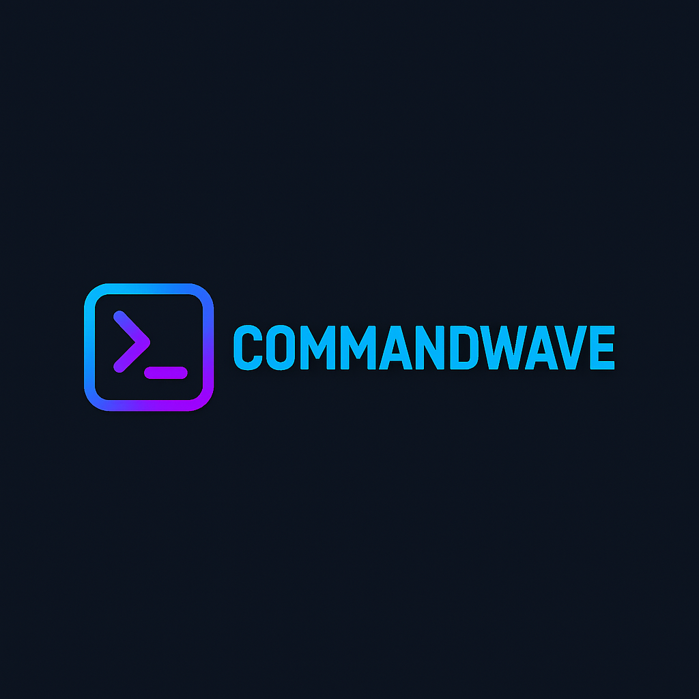

# CommandWave

<div align="center">
  
  <p><em>A cyberpunk terminal management interface with playbook integration</em></p>
</div>

## Overview

CommandWave is a web-based interface for managing multiple terminal sessions side-by-side with Markdown-based playbooks. It features a cyberpunk/neon aesthetic and provides a streamlined interface for executing commands from playbooks with variable substitution.


## Features

- **Terminal Management**: Create, switch between, rename, and close multiple terminal sessions.
- **Playbook Support**: Upload and parse Markdown playbooks with code blocks.
- **Variable Substitution**: Define variables and substitute them in code blocks.
- **Command Execution**: Execute commands directly from playbooks to the active terminal.
- **Notes System**: Global and per-tab notes for keeping track of your work.
- **Local Playbook Search**: Search through your local playbook collection.
- **Cyberpunk UI**: Beautiful neon-inspired interface with consistent theming.
- **Custom tmux Theming**: Included configuration for matching terminal aesthetics.

## Requirements

- Python 3.6+
- Flask
- ttyd (Terminal emulator)
- tmux (Terminal multiplexer)

## Installation

1. Install the required system tools:

   ```bash
   # Install ttyd (check your OS documentation for specific instructions)
   # For example, on Ubuntu:
   sudo apt-get install ttyd
   
   # Install tmux
   sudo apt-get install tmux
   ```

2. Clone the repository:

   ```bash
   git clone https://github.com/yourusername/CommandWave.git
   cd CommandWave
   ```

3. Install Python dependencies:

   ```bash
   pip install -r requirements.txt
   ```

## Running CommandWave

Start the application:

```bash
python main.py
```

By default, the application will run on port 5000. Open your browser and navigate to `http://localhost:5000`.

### Command Line Options

- `--port PORT`: Specify a different port for the web server.
- `--use-default-tmux-config`: Use the default CommandWave tmux configuration file.
- `--debug`: Run in debug mode with more verbose logging.

## Usage Guide

### Terminal Management
- Click the `+` button to add a new terminal tab
- Right-click on a tab to rename or close it
- Switch between terminals by clicking on the tabs

### Variables
- Use the Variables section to define values that can be substituted in playbooks
- Variables will be automatically replaced in playbook commands when executed

### Playbooks
- Upload Markdown files containing code blocks as playbooks
- Execute commands directly from playbooks by clicking the "Execute" button
- Use variables in playbooks with the `$VariableName` syntax

### Search
- Search through all your playbooks to find specific commands or notes
- Copy, execute, or import commands directly from search results

## Contributing

Contributions are welcome! Please feel free to submit a Pull Request.

1. Fork the repository
2. Create your feature branch (`git checkout -b feature/amazing-feature`)
3. Commit your changes (`git commit -m 'Add some amazing feature'`)
4. Push to the branch (`git push origin feature/amazing-feature`)
5. Open a Pull Request

## License

This project is licensed under the MIT License - see the [LICENSE](LICENSE) file for details.

## Acknowledgments

- The cyberpunk styling was inspired by various neon/synthwave aesthetics
- Thanks to the developers of ttyd and tmux for their amazing tools
